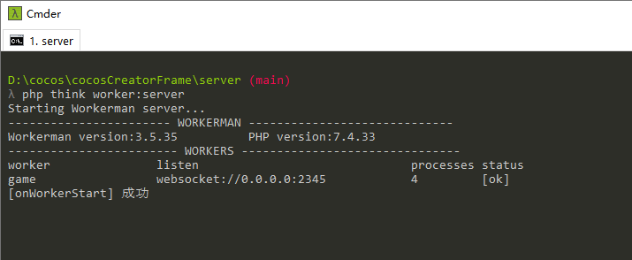

### cocosCreatorFrame
###### cocos 微信小游戏基础框架，整合多平台（微信、快手、抖音等）插屏广告、banner广告、激励视频广告等功能，封装http请求，websocket请求等，打开即用，快速开发

### 项目结构
###### demo文件夹，无后端请求，纯cocos实现的前端，直接打开即可体验
###### client文件夹，有后端请求，与server配合使用，帧同步等功能实现
###### server文件夹，后端逻辑，与client配合使用，帧同步等功能实现

### 项目使用
###### 这里只介绍client和server使用，其中server是使用php框架thinkphp6搭建的websocket服务器

- 1、加载前端，打开cocos客户端，导入项目client文件夹
- 2、进入server文件夹下执行下面命令安装依赖（有报错选择下面的命令）
```
composer install
or 
composer install --ignore-platform-reqs
```
- 3、启动ws服务器（本地测试）
```
php think worker:server
```
- 4、启动ws服务器（线上部署）
```
php think worker:gateway
```

### 项目预览
